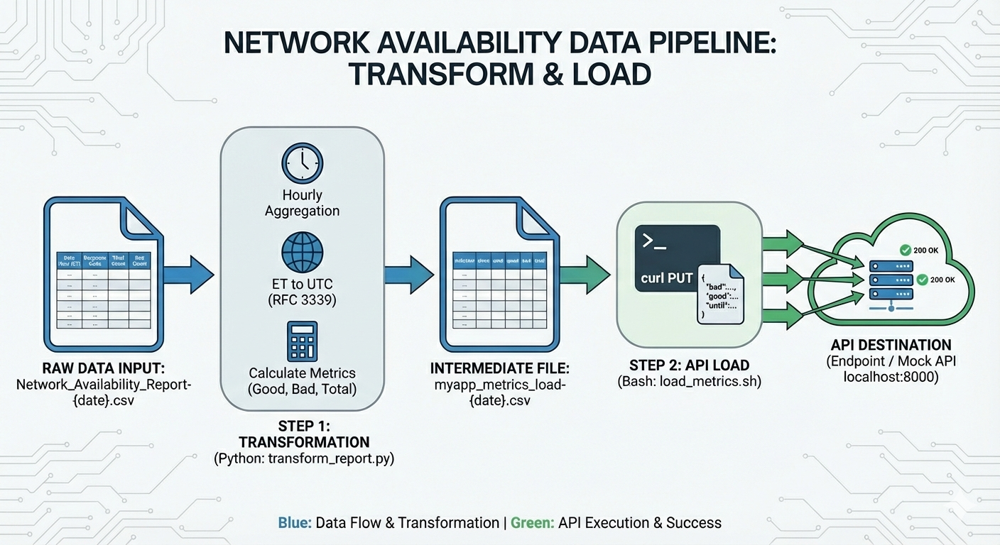

# Network Availability Data Transformation & API Load Lab

This lab demonstrates a two-step pipeline that transforms a daily network availability CSV report into aggregated hourly metrics and then loads those metrics into an API via curl.



## Overview

1. **Transform** — Aggregate raw response-code-level data into hourly totals, convert timestamps from US Eastern to UTC, and output a metrics CSV.
2. **Load** — Read the metrics CSV and make one API PUT call per hour with the aggregated data.

## Files

| File | Description |
|------|-------------|
| `Network_Availability_Report-{date}.csv` | Daily input file with `Total Count` and `Bad Count` by `Response Code` and `Date Hour (ET)` |
| `myapp_metrics_load-{date}.csv` | Transformed output — 1 row per hour with `indicator`, `since`, `until`, `good`, `bad`, `total` |
| `curl_put_metrics-{date}.sh` | Reference curl template showing the API request structure |
| `transform_report.py` | Python script — Step 1: transforms the input CSV into the metrics CSV |
| `load_metrics.sh` | Bash script — Step 2: reads the metrics CSV and makes API calls |
| `mock_api.py` | Simple Python mock API server for testing (port 8000) |
| `generate_mock_data.py` | Utility to generate sample data in the input CSV format |

## Prerequisites

- **Python 3.9+**
- **`tzdata` package** (required on Windows for timezone support):
  ```bash
  pip install -r requirements.txt
  ```
- **Git Bash** (or any Bash-compatible shell for running `load_metrics.sh`)

## Step 1: Transform the Report

```bash
python transform_report.py 2026-02-12
```

- **Input**: `Network_Availability_Report-2026-02-12.csv`
- **Output**: `myapp_metrics_load-2026-02-12.csv`

### What it does

- Groups rows by `Date Hour (ET)` and sums `Total Count` and `Bad Count` across all response codes
- Converts the Eastern Time hour to UTC (dynamically handles EST/EDT)
- Formats timestamps in RFC 3339 (`yyyy-mm-ddTHH:MM:SS.000Z`)
- Computes `good = total - bad`
- Sets `indicator` to `asvmyapp.key-indicator-1`
- Outputs 24 rows (one per hour)

## Step 2: Load Metrics via API

```bash
./load_metrics.sh 2026-02-12
```

- Reads `myapp_metrics_load-2026-02-12.csv`
- For each row, logs the `until` value and executes a curl PUT request
- JSON payload includes: `bad`, `duration` (1 hour in nanoseconds), `good`, `since`, `total`, `until`, `valid` (always `true`)
- The `indicator` value from the CSV is used in the API URL path

### Logging output to a file

```bash
./load_metrics.sh 2026-02-12 > load_metrics_output-2026-02-12.log 2>&1
```

## Testing with the Mock API

Start the mock server in one terminal:

```bash
python mock_api.py
```

Run the load script in a second terminal:

```bash
./load_metrics.sh 2026-02-12
```

The mock API returns `{"message": "implementation pending development"}` with a 200 status for all requests.
